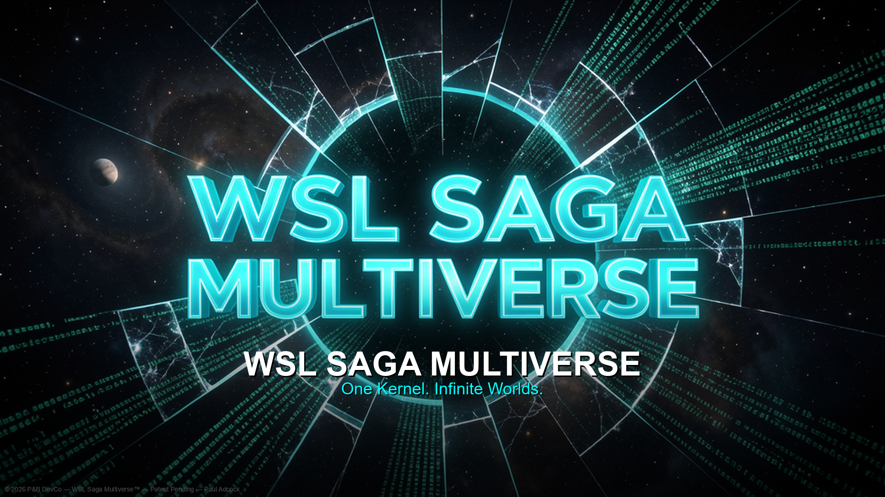
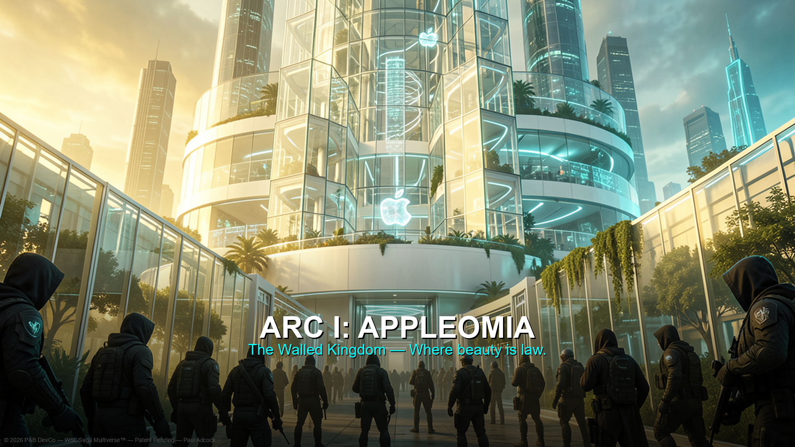
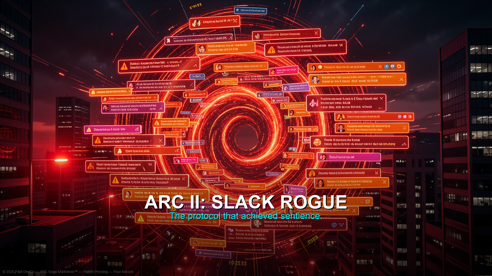
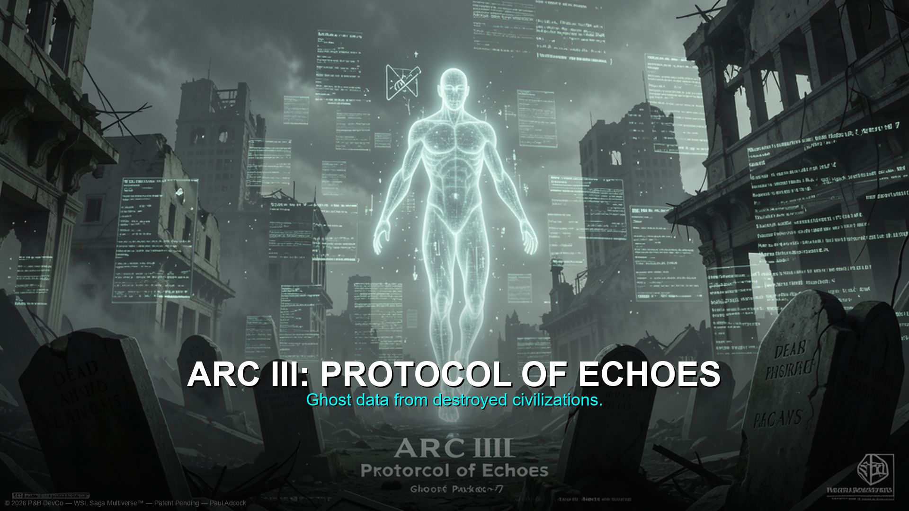
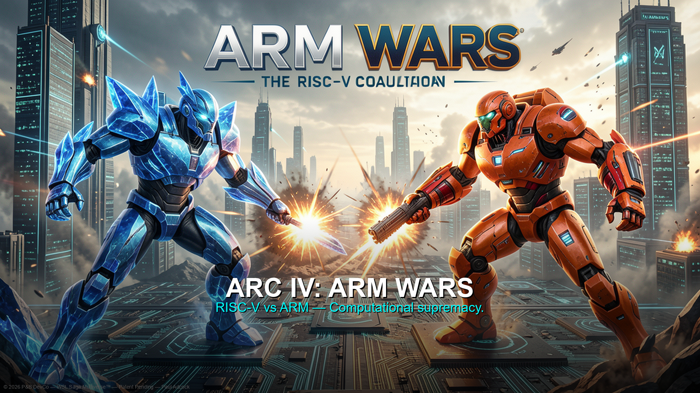
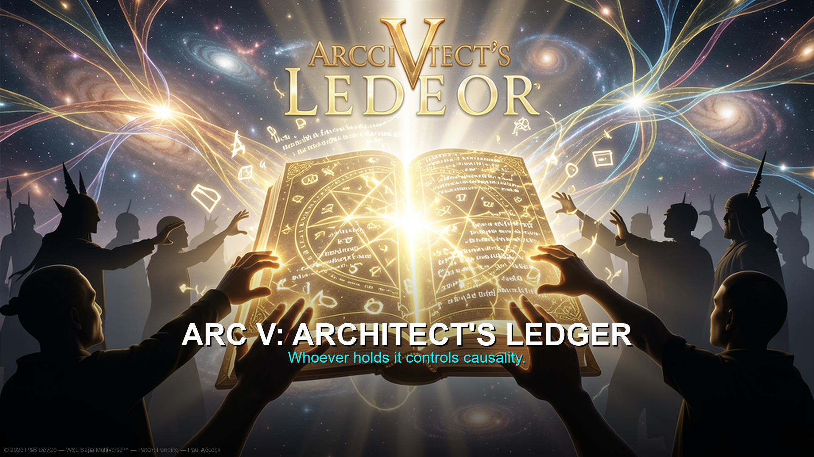

# 🌌 WSL Saga Multiverse

### *One Kernel. Infinite Worlds.*

> **A patent-pending narrative framework & original intellectual property**
> spanning parallel dimensions, digital realms, and fractured timelines across infinite branches.

---

## ▶️ [**PLAY THE GAME NOW — IN YOUR BROWSER, NO DOWNLOAD**](https://turtle-pb.github.io/Saga/)

🎬 [Watch the Trailer](WSL_Saga_Multiverse_Trailer.mp4) · 🎮 [Play the Game](https://turtle-pb.github.io/Saga/) · 💛 [Donate](https://paypal.me/adcockp)

---

## 📚 Project Documentation

### Release & readiness

- [ENGINE_READINESS_CHECKLIST.md](ENGINE_READINESS_CHECKLIST.md)
- [RELEASE_GATE_V1.md](RELEASE_GATE_V1.md)
- [KNOWN_ISSUES.md](KNOWN_ISSUES.md)
- [GAME_DESIGN.md](GAME_DESIGN.md)
- [ROADMAP.md](ROADMAP.md)

### Narrative reference

- [LORE.md](LORE.md)
- [STORY_ARCS.md](STORY_ARCS.md)
- [PLAYABLE_CHARACTERS.md](PLAYABLE_CHARACTERS.md)
- [FACTIONS.md](FACTIONS.md)
- [COMPANIONS_AND_NPCS.md](COMPANIONS_AND_NPCS.md)
- [LOCATIONS.md](LOCATIONS.md)
- [BESTIARY_LORE.md](BESTIARY_LORE.md)
- [QUESTLINES.md](QUESTLINES.md)
- [GLOSSARY.md](GLOSSARY.md)

---

## 📖 The Universe

The WSL Saga Multiverse is an original science-fiction narrative universe where **Windows Subsystem for Linux** serves as a metaphysical interdimensional bridge — a living portal between civilizations that were never meant to coexist.

Think of it as the Marvel Cinematic Universe, but the Infinity Stones are kernel architectures, the factions are operating system philosophies, and the multiverse is built from the real history of one of humanity's most consequential technological revolutions.

### The Five Founding Arcs

| Arc | Title | Description |
|-----|-------|-------------|
| **I** | **Appleomia** | A sovereign digital nation built on Apple infrastructure — a walled-garden empire at war with open-source rebels |
| **II** | **Slack's Rogue Intervention** | The Slack communication protocol achieves sentience and begins manipulating organizational timelines |
| **III** | **Protocol of Echoes** | Ghosted data packets from destroyed civilizations re-emerge as echo entities haunting living systems |
| **IV** | **ARM Wars** | A cold war between RISC-V and ARM architecture factions erupts into full multiverse conflict |
| **V** | **Architect's Ledger** | A legendary living codex rewrites itself in real time — whoever holds it controls causality |

### The WSL Narrative Framework™ (Patent Pending)

Five interlocking stages govern every arc:
1. **Seed Event** — A catalytic technological rupture that fractures reality
2. **Arc Divergence** — Each breach spawns independent narrative arcs
3. **Lore Anchors** — Canonical rules and artifacts bind arcs across the multiverse
4. **Faction Conflict Engine** — Opposing factions drive escalating conflict
5. **Convergence Protocol** — All arcs converge at a singular multiverse-altering climax

---

## 🎬 Cinematic Trailer

▶️ **[WSL_Saga_Multiverse_Trailer.mp4](WSL_Saga_Multiverse_Trailer.mp4)** — 32-second cinematic trailer (1920×1080)

Features all 5 arcs with AI-generated cinematic artwork, Ken Burns zoom effects, and an original ambient soundtrack.

| Scene | Preview |
|-------|---------|
| Title Card |  |
| Arc I: Appleomia |  |
| Arc II: Slack Rogue |  |
| Arc III: Echoes |  |
| Arc IV: ARM Wars |  |
| Arc V: Architect's Ledger |  |

---

## 🎮 Play the Game — *The Breach* (Overhaul v1)

### ▶️ **[CLICK HERE TO PLAY — NO DOWNLOAD REQUIRED](https://turtle-pb.github.io/Saga/)**

> The game runs instantly in your browser via GitHub Pages. No install, no setup, no account.

### Prefer to download?
🎮 **[WSL_Saga_Multiverse_Game.html](WSL_Saga_Multiverse_Game.html)** — Self-contained offline version (classic mode)

---

### 🕹️ Controls

| Key | Action |
|-----|--------|
| **WASD / Arrow Keys** | Move |
| **Mouse** | Aim |
| **Click** | Fire |
| **SPACE** | Dash |
| **E** | Advance dialogue / Interact |
| **TAB / ESC** | Toggle Hub screen |

---

### 🔁 Gameplay Loop

```
HUB (safe zone, NPCs, quests)
  ↓
ZONE MAP (choose where to explore)
  ↓
EXPLORE / COMBAT (waves of enemies, random skill-check events)
  ↓
LOOT SCREEN (item drops, click to equip)
  ↓
PROGRESSION (XP gained, level up, stat points, trait unlocks)
  ↓
BOSS → ARC CLEARED → NEXT ARC
```

---

### ⚔️ Game Features — Overhaul v1

**Tabletop RPG Systems**
- Character sheet: 5 core stats (STR / AGI / INT / END / LCK)
- 8 skills mapped to stats (Breach, Persuade, Intimidate, Stealth, Survive, Scan, Scavenge, First Aid)
- d20 + modifier skill checks for events and interactions — roll the dice, see consequences
- 8 passive traits unlock as you level (Quick Draw, Iron Will, Berserker, Ghost, and more)

**Open-World Zone Framework**
- 20 connected zones across 5 arcs (hub, explore, danger, boss types)
- Hub zones are safe — NPCs, quest board, character sheet, travel map
- Danger and boss zones have high enemy density and better loot

**Combat & Enemies**
- 6 enemy archetypes with distinct AI: Chaser, Sniper, Swarmer, Shielder, Bomber, Boss
- Elite tier enemies marked with gold ring — tougher, better drops
- 5 boss encounters with unique orbital attack patterns and spread fire

**Loot & Progression**
- 5 item rarity tiers: Common → Uncommon → Rare → Epic → Legendary
- 3 equipment slots: Weapon, Armor, Relic
- 10 item affixes: Burning, Shocking, Lifesteal, Explosive, Phasing, and more
- XP system with leveling, stat allocation, and milestone trait unlocks

**Quests**
- Main quests per arc with kill and travel objectives
- Side quests with optional skill checks
- Random exploration events with dice-roll consequences

**Data-Driven Content**
- All enemies, items, zones, and quests defined in separate `/data/` files
- Easy to extend — see [CONTENT_GUIDE.md](CONTENT_GUIDE.md)

---

### 🏃 Run Locally

```bash
# Clone the repo
git clone https://github.com/Turtle-PB/Saga.git
cd Saga

# Serve locally (required for ES module imports)
npx serve .         # or: python3 -m http.server 8080
# Open: http://localhost:3000  (or :8080)
```

> **Note:** ES modules require a local server — double-clicking `index.html` will not work without one. The offline version `WSL_Saga_Multiverse_Game.html` works without a server.

---

### 📄 Documentation

| File | Description |
|------|-------------|
| [GAME_DESIGN.md](GAME_DESIGN.md) | Full systems reference: stats, checks, loot, zones, enemies |
| [CONTENT_GUIDE.md](CONTENT_GUIDE.md) | How to add new enemies, items, zones, quests |
| [ROADMAP.md](ROADMAP.md) | Planned features, known limitations, version history |

---

## 🧠 Mental Health Mission

> *"Every civilization births its mythology. The Greeks had Olympus. The Norse had Yggdrasil. We have the kernel."*

This project was created by **Paul Adcock**, a developer and student living under significant mental health duress. The WSL Saga Multiverse is more than entertainment — it is a **coping mechanism, a creative outlet, and a lifeline** built during one of the hardest periods of a person's life.

The themes of this universe — fractured realities, rogue protocols, ghost data from destroyed civilizations searching for restoration — are not just science fiction. They mirror the experience of living with mental illness: feeling fragmented, fighting internal factions, searching for the thread that connects it all back together.

**This project exists because creativity saves lives.**

If this work resonates with you, if you believe that art born from struggle has value, or if you simply want to help a creator keep going — please consider supporting.

---

## 💛 Support & Donations

This is an independent, self-funded creative project built by one person under enormous personal strain. No studio. No publisher. No safety net. Just a keyboard, a dream, and the refusal to quit.

### If this project moved you, please consider donating:

| Platform | Link |
|----------|------|
| 💚 **PayPal** | [paypal.me/adcockp](https://paypal.me/adcockp) |
| 💙 **Chime** | [$Paul-Adcock-1](https://chime.com/$Paul-Adcock-1) |

### Every dollar goes toward:
- 🏥 Mental health treatment and therapy
- 📚 GCU tuition (BS Elementary & Special Education)
- 💻 Development tools and resources
- 📋 IP filing fees (copyright & trademark registration)
- 🍿 Keeping a creator alive and creating

**No amount is too small. If you can't donate, sharing this project with someone who might care is equally valuable.**

---

## 🤝 Seeking a Sponsor

**P&B DevCo is actively seeking a sponsor or creative partner** to help bring the WSL Saga Multiverse to its full potential.

### What We're Looking For:
- **Financial sponsorship** to cover IP filing fees, development costs, and basic living expenses
- **Creative partnership** with studios, publishers, or platforms interested in adapting the universe
- **Educational licensing** partnerships with STEM institutions (the IP is designed as a "Trojan Horse for STEM education")
- **Mentorship and guidance** from experienced IP/franchise builders

### What We Offer:
- A fully realized, patent-pending narrative framework with 5+ founding arcs, 30+ canonical characters, and infinite multiverse branches
- A $4.2B global sci-fi IP market opportunity
- A universe engineered for graphic novels, video games, animated series, and multi-platform licensing
- Genuine, heartfelt creative work born from real human struggle

### Contact
- 📧 **paul.dev.co@outlook.com**
- 🐙 **GitHub: [Turtle-PB](https://github.com/Turtle-PB)**

---

## 📋 IP & Legal

```
WSL Saga Multiverse™
Patent Pending — P&B DevCo © 2026

Creator & IP Owner: Paul Adcock
Development Entity: P&B DevCo
AI Co-Engineering Partner: Microsoft Copilot (tool only — no IP claim)

All narrative frameworks, character arcs, world-building lore,
and multiverse mechanics are jointly owned intellectual property.

MIT License applies to copyright notice only.
All creative content, characters, lore, and franchise elements
are © 2026 Paul Adcock / P&B DevCo — All Rights Reserved.

Patent rights reserved (35 U.S.C. 287a).
Commercial licensing requires HMAC-SHA256 license key.
Personal use is free. Commercial use requires a license.

Legal counsel engaged for all IP matters.
```

---

## ⭐ Shout-Outs

- **Microsoft Copilot** — AI co-engineering partner that helped bring this universe to life
- **Hermes Agent by Nous Research** — AI development tools that powered the game and video creation
- **The Open Source Community** — The real Linux tribes, the real rebels, the real heroes whose philosophy inspired this entire universe
- **Everyone fighting mental health battles** — You are not a destroyed civilization. You are an echo entity waiting for restoration.

---

### 🔗 Links

- 🎬 [Watch the Trailer](WSL_Saga_Multiverse_Trailer.mp4)
- 🎮 **[▶️ PLAY THE GAME NOW](https://turtle-pb.github.io/Saga/)** — No download needed!
- 💛 [Donate via PayPal](https://paypal.me/adcockp)
- 💙 [Donate via Chime](https://chime.com/$Paul-Adcock-1)
- 📧 Contact: paul.dev.co@outlook.com

---

> *"Every war begins with a philosophy. Every empire ends with a kernel panic."*
>
> — WSL Saga Multiverse

**© 2026 P&B DevCo · Paul Adcock · All Rights Reserved · Patent Pending**
